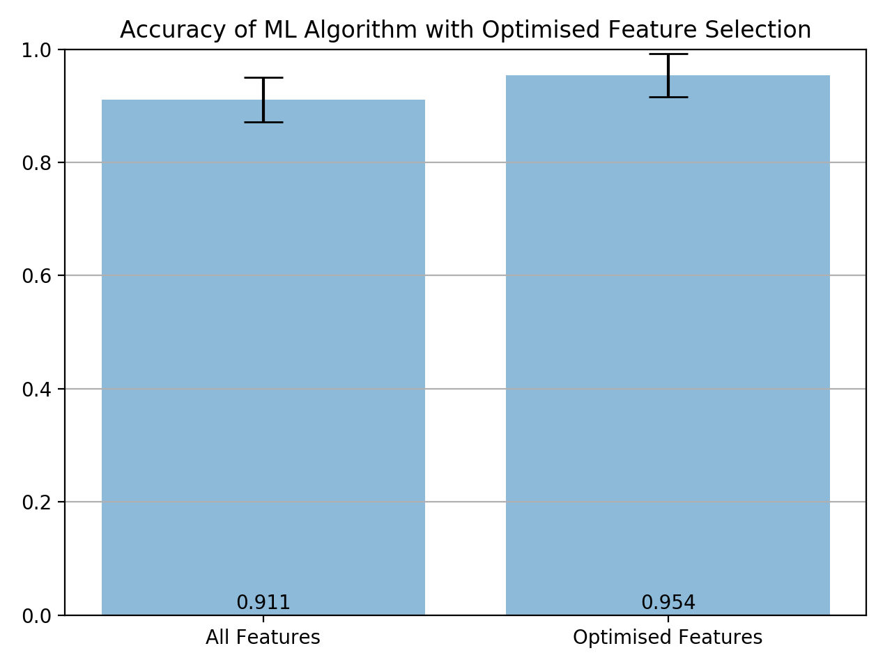

# Optimising_ML_feature_selection
Optimising ML feature selection with binary global optimisation.

This python code uses the particle swarm binary global optimisation algorthim to optimise features in a dataset to maximise accuracy. Using a simple dataset on wine classification, it was found this method increased the accuracy of a decision tree classifer by 4.7% over using all features of the dataset.

# The Code
Code starts with switching the training process to the GPU using plaidml. This is faster and more efficent than training the models on the CPU, especially if you are training 100s.

The inputs are generated into the model using the split_sequence function. This generates a sequence of past observations as input. The number of observations depends on the users stated window size.

Model is built using keras.tensorflow. The hyperparameters to be optimised for the model are the number of convolutional 1d layers, the dropout rate, the number of dense layers within specified constraints.

The bayesian optimsier returned the best model based on validation loss.

## Requirements
* python 3.5.x
* pandas 1.1
* numpy 1.15.0
* matplotlib 3.3.0
* sys
* os
* sklearn
* warnings
* datetime
* pyswarm

